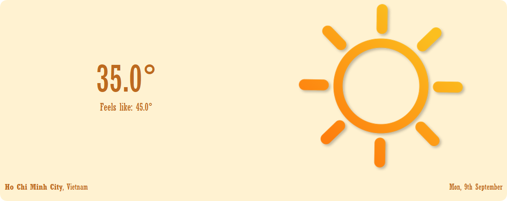
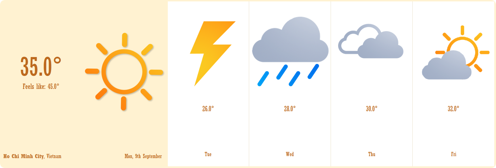
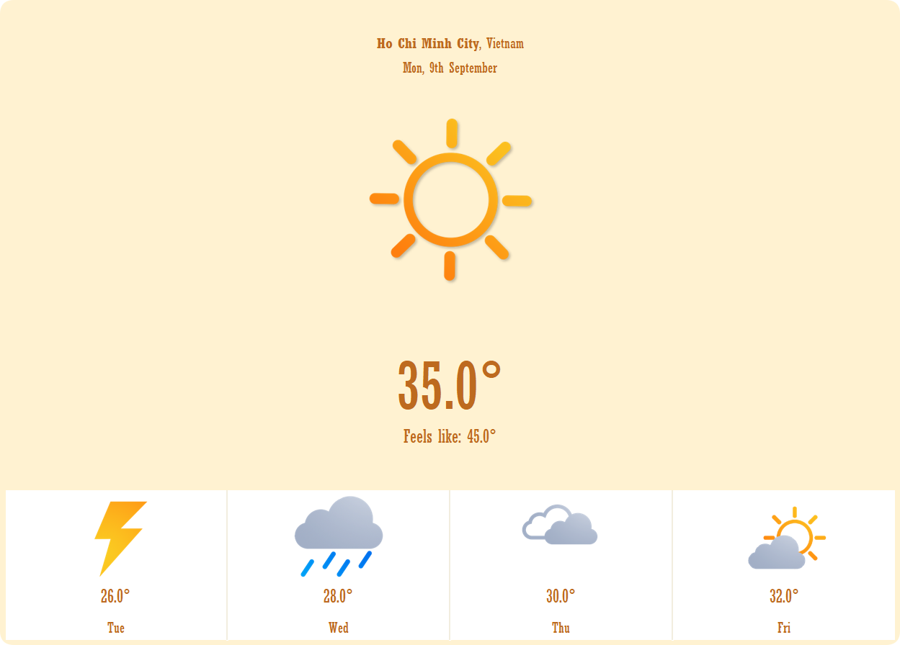

# WEATHER FORECAST GUI APPLICATION

    <em>
        The Weather Forecast GUI application is expertly crafted to deliver precise and timely weather updates to users. Utilizing advanced web crawling technology, the application automatically retrieves location coordinates and weather data from reputable sources, providing detailed forecasts for the current day and the days ahead for a specified area. Its responsive design, with four adaptable display levels, is enhanced by intuitive visuals and dynamic animations, creating a seamless and visually engaging user experience. Whether you are tracking local weather or monitoring conditions anywhere in the world, this application ensures that you stay informed with clarity, ease, and professionalism.
    </em>

